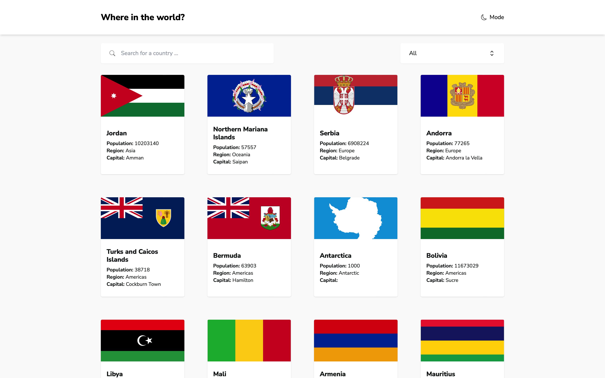
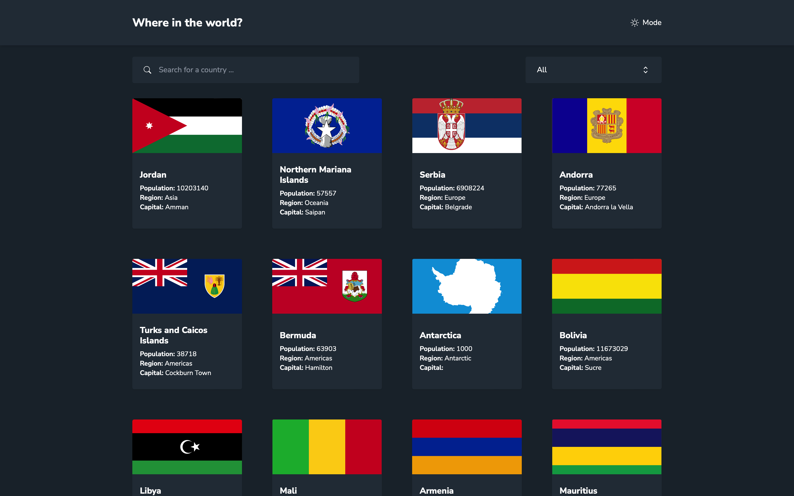
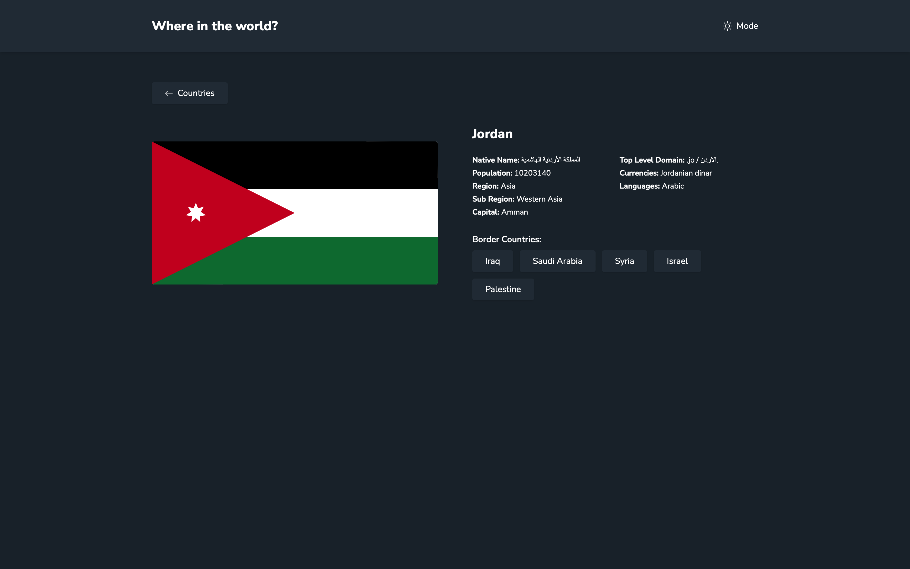
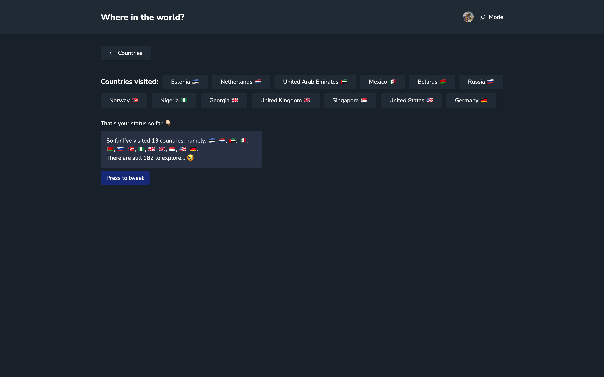

## Live

You can check out the live version of the project here -> [https://countries-martinideniam.vercel.app/](https://countries-martinideniam.vercel.app/).

# Countries Web App

Welcome to my Countries Web App repository. This project is a solution to the Countries web app challenge on [Frontend Mentor](https://www.frontendmentor.io).

## The Challenge

The challenge involved building an application that allowed users to:

- See all countries from the API on the homepage
- Search for a country using an input field
- Filter countries by region
- Click on a country to see more detailed information on a separate page
- Click through to the border countries on the detail page
- Bonus: Toggle the color scheme between light and dark mode

I've additionally added ability for the users to log in, save the countries they've visited and generate some tweet based on that info.

## Technologies Used

This project was built using the following technologies:

- Typescript
- Next.js (with App Router)
- Tailwind CSS
- Prisma
- MongoDB
- Next Auth

## Screenshots

## Contact Me

For any inquiries or feedback, feel free to get in touch with me through:

- [GitHub](https://github.com/vladislav-gorovenko)
- [LinkedIn](https://www.linkedin.com/in/vladislav-gorovenko-web/)
- [FrontendMentor](https://www.frontendmentor.io/profile/martinideniam/)
- [Telegram](https://t.me/vlad_webdev_iam)

## Feedback

If you have any feedback or suggestions, please open an issue here on [GitHub](https://github.com/vladislav-gorovenko/countries/issues).
